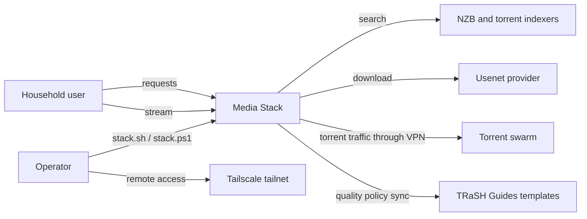
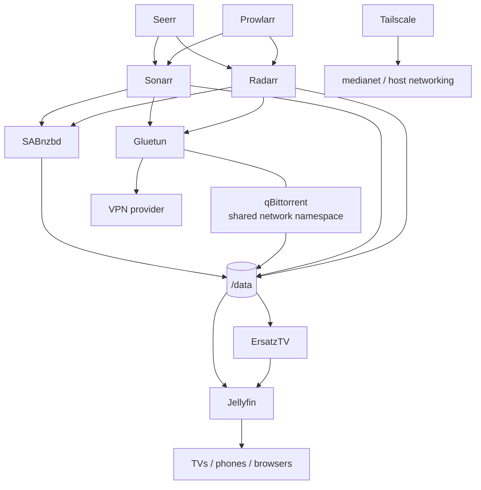
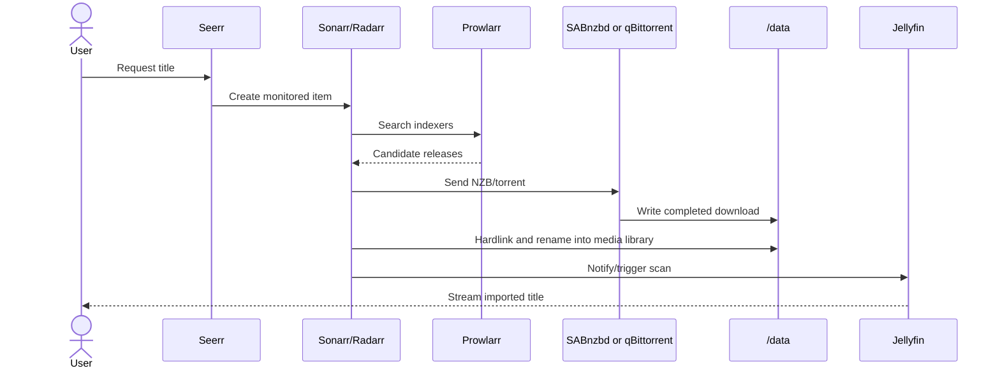
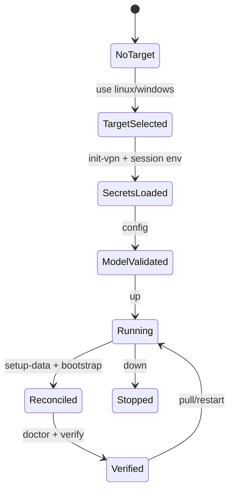
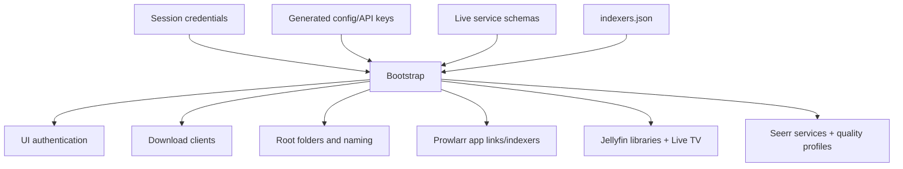
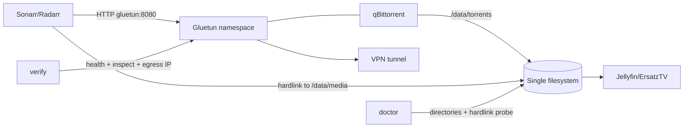

# Media Stack Architecture and Onboarding Guide

> Snapshot: `mhendricks42/media-stack`, branch `fix/linux-issues`, commit
> `c3e613c38480af3b9f10201157ff7bc7306a7b0c` (`2026-10-06`).
> The working tree was dirty when this document was generated; this guide
> describes the checked-out files, including uncommitted changes.

## Part 1 — Whole-repository technical deep-dive

### What this repository is

Media Stack is a self-hosted media automation deployment that uses one
platform-neutral Docker Compose model plus Linux and Windows overlays. The same
service pipeline can therefore be exercised on a Windows workstation before
the Compose changes are promoted to a Linux production host
([readme.md](readme.md#L1-L9)). It is an infrastructure-and-automation
repository, not an application implementation: upstream containers provide the
applications, while this repository owns their topology, runtime configuration,
bootstrap wiring, operational checks, and cross-platform wrappers.

### Technology detection

| Layer | Technology | Evidence |
|---|---|---|
| Container orchestration | Docker Engine 24+ and Docker Compose plugin | [readme.md](readme.md#L157-L163) |
| Deployment definition | Compose base file plus target, secret, and optional GPU overlays | [readme.md](readme.md#L81-L125), [docker-compose.yml](docker-compose.yml#L1-L10) |
| Windows automation | PowerShell wrapper and idempotent bootstrap scripts | [stack.ps1](stack.ps1#L1-L29), [scripts/bootstrap.ps1](scripts/bootstrap.ps1#L1-L25) |
| Linux automation | Bash wrapper and bootstrap scripts; bootstrap also requires `curl`, `jq`, and Python 3 | [stack.sh](stack.sh#L1-L20), [scripts/bootstrap.sh](scripts/bootstrap.sh#L975-L979) |
| Service APIs | Sonarr/Radarr v3 APIs, Prowlarr v1 API, qBittorrent, SABnzbd, Jellyfin, and Seerr APIs | [scripts/bootstrap.sh](scripts/bootstrap.sh#L3-L11), [scripts/bootstrap.ps1](scripts/bootstrap.ps1#L77-L106) |
| Jellyfin extension | Pinned Moonbase plugin for Moonfin web hosting, settings sync, and Seerr integration | [env/linux.env.example](env/linux.env.example#L18-L24), [scripts/bootstrap-jellyfin.ps1](scripts/bootstrap-jellyfin.ps1#L123-L238) |
| Declarative policy | YAML Recyclarr profiles and JSON Prowlarr indexer definitions | [recyclarr.example.yml](recyclarr.example.yml#L1-L16), [indexers.example.json](indexers.example.json#L1-L46) |
| Persistent state | Bind-mounted application configuration, mostly SQLite/XML/INI/JSON owned by upstream services | [docker-compose.yml](docker-compose.yml#L58-L60), [readme.md](readme.md#L148-L155) |
| Shared media storage | One `/data` tree for Usenet, torrents, and media to preserve hardlinks | [readme.md](readme.md#L73-L79), [readme.md](readme.md#L536-L548) |
| Private networking | `medianet` bridge for application traffic; qBittorrent shares Gluetun's network namespace | [docker-compose.yml](docker-compose.yml#L10-L13), [docker-compose.yml](docker-compose.yml#L45-L50) |
| Remote access | Host-network Tailscale on Linux; optional userspace container on Windows | [compose/linux.yml](compose/linux.yml#L1-L19), [compose/windows.yml](compose/windows.yml#L1-L19) |

### Entry points

There is no compiled backend or frontend entry point. Operators enter through:

1. `stack.sh` on Linux, whose command dispatcher starts at
   [stack.sh](stack.sh#L277-L447).
2. `stack.ps1` on Windows, whose command dispatcher starts at
   [stack.ps1](stack.ps1#L367-L562).
3. `docker compose` directly, with `COMPOSE_FILE` selected by `.env`
   ([env/linux.env.example](env/linux.env.example#L1-L8),
   [env/windows.env.example](env/windows.env.example#L1-L9)).
4. The application HTTP UIs and APIs exposed on host ports defined in
   [docker-compose.yml](docker-compose.yml#L24-L27) and
   [docker-compose.yml](docker-compose.yml#L64-L215).

### Commands and verification inventory

The Bash and PowerShell wrappers intentionally expose nearly the same lifecycle.
PowerShell additionally provides `env` and `init-windows`; Bash session secrets
are loaded by sourcing `scripts/set-env.sh`.

| Command | Purpose | Evidence / status |
|---|---|---|
| `./stack.sh use linux` / `.\stack.ps1 use windows` | Replace `.env` with the selected platform template | [stack.sh](stack.sh#L278-L287), [stack.ps1](stack.ps1#L368-L374) |
| `source ./scripts/set-env.sh` / `.\stack.ps1 env` | Prompt for session-scoped application credentials | [readme.md](readme.md#L165-L217), [stack.ps1](stack.ps1#L438-L450) |
| `./stack.sh init-vpn` / `.\stack.ps1 init-vpn` | Create ignored, newline-free VPN secret files with restrictive permissions | [stack.sh](stack.sh#L50-L93), [stack.ps1](stack.ps1#L66-L147) |
| `./stack.sh config` / `.\stack.ps1 config` | Render the active merged Compose model and redact selected secret fields | [stack.sh](stack.sh#L371-L375), [stack.ps1](stack.ps1#L484-L493) |
| `docker compose --env-file env\<target>.env.example -f ... config --quiet` | Non-mutating Compose syntax/merge check; both Linux and Windows variants passed while writing this document | Overlay composition is defined in [env/linux.env.example](env/linux.env.example#L1-L8) and [env/windows.env.example](env/windows.env.example#L1-L9) |
| `./stack.sh up` / `.\stack.ps1 up` | Validate runtime secrets, then start services detached | [stack.sh](stack.sh#L291-L295), [stack.ps1](stack.ps1#L387-L391) |
| `./stack.sh setup-data` / `.\stack.ps1 setup-data` | Create the shared `/data` directory contract without changing existing paths | [stack.sh](stack.sh#L305-L336), [stack.ps1](stack.ps1#L401-L436) |
| `./stack.sh bootstrap` / `.\stack.ps1 bootstrap` | Configure credentials, integrations, clients, root folders, Jellyfin, and Seerr | [stack.sh](stack.sh#L338-L340), [stack.ps1](stack.ps1#L452-L455) |
| `./stack.sh import-indexers [path] --dry-run` / PowerShell equivalent | Render or apply Prowlarr indexers from local JSON | [stack.sh](stack.sh#L342-L359), [stack.ps1](stack.ps1#L456-L470) |
| `./stack.sh sync-profiles --preview` / PowerShell equivalent | Preview or apply Recyclarr quality profiles | [stack.sh](stack.sh#L187-L210), [stack.ps1](stack.ps1#L164-L193) |
| `./stack.sh doctor` / `.\stack.ps1 doctor` | Check target selection, secrets, Compose rendering, containers, paths, hardlinks, tunnel state, and endpoints | [stack.sh](stack.sh#L217-L274), [stack.ps1](stack.ps1#L211-L280) |
| `./stack.sh verify` / `.\stack.ps1 verify` | Check tunnel health, inspect-time VPN credential exposure, and distinct host/VPN public IPs | [stack.sh](stack.sh#L395-L432), [stack.ps1](stack.ps1#L523-L558) |
| `./stack.sh backup` / `.\stack.ps1 backup` | Stop services, archive sensitive deployment state, then restart | [stack.sh](stack.sh#L434-L442), [stack.ps1](stack.ps1#L513-L521) |
| Unit/single-test command | None exists. This repository has operational smoke checks rather than a unit-test framework. | [INFERRED] Current tracked scripts and documented command list at [readme.md](readme.md#L477-L499) |
| Lint / format / typecheck | No canonical command is defined. PowerShell files did pass parser validation while this document was written. | [INFERRED] No manifest/task-runner command; wrapper usage is enumerated at [stack.ps1](stack.ps1#L17-L29) |
| CI workflow | No workflow is present in this checkout. A historical summary describes one on a separate `ci/compose-validation` branch, not in the current branch. | [Resolved contradiction] [docs/IMPLEMENTATION_SUMMARY.md](docs/IMPLEMENTATION_SUMMARY.md#L128-L169) |
| CI enforcement | **[UNVERIFIED]** No current CI workflow exists, and required-check/branch-protection settings are remote platform configuration. | Manual confirmation in repository settings is required. |

### Repository layout

| Path | Purpose |
|---|---|
| `docker-compose.yml` | Platform-neutral service graph, bridge network, ports, volumes, and shared runtime defaults. |
| `compose/` | Linux/Windows target differences, Docker secrets, and optional Intel/NVIDIA GPU reservations. |
| `env/` | Copyable non-secret deployment templates that select overlays and platform defaults. |
| `scripts/` | Bootstrap, authentication, indexer import, environment prompting, and Windows storage preparation. |
| `docs/` | Historical implementation notes plus VPN and image-update policy. Some claims are stale; see contradictions below. |
| `config/` | Ignored runtime state generated by upstream applications; may contain databases, API keys, and sessions. |
| `secrets/` | Ignored VPN credential files mounted through Compose secrets. |
| `stack.sh`, `stack.ps1` | Stable operator-facing lifecycle façades. |
| `recyclarr.example.yml` | Versioned quality-profile intent copied into ignored runtime configuration on first sync. |
| `indexers.example.json` | Safe indexer schema example; the active `indexers.json` is ignored because it may contain private credentials. |

The ignore boundary is deliberate: application state, `.env`, active indexer
configuration, backups, and VPN secrets are excluded in
[.gitignore](.gitignore#L1-L16).

### Deployment and runtime surface

The stack has 11 base services and one target-specific Tailscale service. No
container image is currently immutable or even version-pinned.

| Surface | Current pin | Consequence | Evidence |
|---|---|---|---|
| Gluetun | `qmcgaw/gluetun:latest` | Floating VPN runtime | [docker-compose.yml](docker-compose.yml#L15-L18) |
| qBittorrent | `lscr.io/linuxserver/qbittorrent:latest` | Floating torrent client | [docker-compose.yml](docker-compose.yml#L44-L46) |
| SABnzbd | `lscr.io/linuxserver/sabnzbd:latest` | Floating Usenet client | [docker-compose.yml](docker-compose.yml#L63-L65) |
| Prowlarr | `lscr.io/linuxserver/prowlarr:latest` | Floating indexer manager | [docker-compose.yml](docker-compose.yml#L80-L82) |
| Sonarr | `lscr.io/linuxserver/sonarr:latest` | Floating TV automation | [docker-compose.yml](docker-compose.yml#L96-L98) |
| Radarr | `lscr.io/linuxserver/radarr:latest` | Floating movie automation | [docker-compose.yml](docker-compose.yml#L113-L115) |
| Bazarr | `lscr.io/linuxserver/bazarr:latest` | Floating subtitle service | [docker-compose.yml](docker-compose.yml#L130-L132) |
| Jellyfin | `lscr.io/linuxserver/jellyfin:latest` | Floating media server | [docker-compose.yml](docker-compose.yml#L147-L149) |
| ErsatzTV | `jasongdove/ersatztv:latest` | Floating pseudo-live service | [docker-compose.yml](docker-compose.yml#L164-L166) |
| Recyclarr | `recyclarr/recyclarr:latest` | Floating one-shot policy synchronizer | [docker-compose.yml](docker-compose.yml#L179-L200) |
| Seerr | `seerr/seerr:latest` | Floating request UI | [docker-compose.yml](docker-compose.yml#L202-L215) |
| Tailscale, both targets | `tailscale/tailscale:latest` | Floating remote-access agent | [compose/linux.yml](compose/linux.yml#L1-L4), [compose/windows.yml](compose/windows.yml#L1-L6) |
| Moonbase Jellyfin plugin | `2.4.0.0` in both target templates | Pinned plugin package installed through Jellyfin's catalog API | [env/linux.env.example](env/linux.env.example#L18-L24), [env/windows.env.example](env/windows.env.example#L19-L25) |
| Docker runtime | Docker Engine 24+ | Host prerequisite, not repository-pinned | [readme.md](readme.md#L157-L163) |
| PowerShell/Bash/Python/jq/curl | No exact versions | Script behavior depends on host tools | [readme.md](readme.md#L161-L163), [scripts/bootstrap.sh](scripts/bootstrap.sh#L975-L979) |
| Persistent stores | Upstream app-local files under `config/`; no standalone DB/cache/broker image | Upgrade compatibility is delegated to each upstream image | [readme.md](readme.md#L148-L155), [docker-compose.yml](docker-compose.yml#L58-L60) |

### EOL, dead-dependency, and drift scan

1. **All images float on `latest`.** Exact versions, support status, and
   reproducibility cannot be established from the checkout. This is not proof of
   EOL, but it prevents an auditable EOL assessment and permits unreviewed major
   upgrades. The repository's own image policy explains the supply-chain and
   rollback risks ([docs/IMAGE_TAG_POLICY.md](docs/IMAGE_TAG_POLICY.md#L3-L11)).
2. **[Resolved contradiction] The image policy is aspirational/stale.** It claims
   specific pinned versions ([docs/IMAGE_TAG_POLICY.md](docs/IMAGE_TAG_POLICY.md#L69-L82)),
   while the authoritative Compose files use `latest` for every image. Current
   Compose source wins.
3. **[Resolved contradiction] Recyclarr is not pinned.** Its Compose comment says
   no `latest` tag exists and a major should be pinned, but the next line uses
   `recyclarr/recyclarr:latest`
   ([docker-compose.yml](docker-compose.yml#L179-L187)). The README now correctly
   reports that every image floats on `latest`
   ([readme.md](readme.md#L583-L588)); the Compose comment remains stale.
4. **Gluetun health semantics are internally inconsistent.** The healthcheck is
   commented out, while qBittorrent waits for `service_healthy`
   ([docker-compose.yml](docker-compose.yml#L37-L50)). Both `doctor` and `verify`
   also require a literal `healthy` state
   ([stack.sh](stack.sh#L260-L266), [stack.sh](stack.sh#L399-L411)).
   Compose rendering succeeds because this is semantic drift, not YAML syntax
   failure.
5. **[Resolved contradiction] Historical fix claims are not current behavior.**
   The implementation summary says the healthcheck and pinned-image changes were
   completed on separate branches
   ([docs/IMPLEMENTATION_SUMMARY.md](docs/IMPLEMENTATION_SUMMARY.md#L15-L32),
   [docs/IMPLEMENTATION_SUMMARY.md](docs/IMPLEMENTATION_SUMMARY.md#L74-L104)).
   The checked-out source shows those changes are absent, so the summary is
   historical rather than a reliable current-state inventory.
6. **Readarr is deliberately excluded.** The README says it was archived in
   2025 ([readme.md](readme.md#L35-L52)). The archive date is
   **[UNVERIFIED]** because this document did not use a remote source.

### Data, APIs, jobs, CI/CD, and testing

- **Data plane:** SABnzbd writes `/data/usenet`, qBittorrent writes
  `/data/torrents`, Sonarr/Radarr hardlink into `/data/media`, and
  Jellyfin/ErsatzTV consume the finished tree
  ([readme.md](readme.md#L73-L79)).
- **Control plane:** Bootstrap reads generated local API keys and performs
  idempotent API upserts. It treats the running applications as the source of
  schemas for download clients and indexers
  ([scripts/bootstrap.sh](scripts/bootstrap.sh#L914-L958),
  [scripts/bootstrap.ps1](scripts/bootstrap.ps1#L890-L1034)).
- **Background/on-demand jobs:** Recyclarr is profile-gated and invoked only by
  `sync-profiles` ([docker-compose.yml](docker-compose.yml#L179-L200)).
  Application-internal schedulers are upstream container behavior and are
  outside this checkout.
- **CI/CD:** There is no current workflow or automated deployment. Promotion is
  a documented manual dev-to-prod process
  ([readme.md](readme.md#L550-L567)).
- **Testing:** `config` validates model rendering; `doctor` checks structural and
  live dependencies; `verify` checks the VPN seam. Reset instructions are
  destructive manual integration-test recipes, not an automated suite
  ([readme.md](readme.md#L501-L534)).

## Part 2 — Context and ecosystem

### Local checkout identity

| Item | Value | Confidence |
|---|---|---|
| Remote | `https://github.com/mhendricks42/media-stack.git` (`media-stack-git`) | High, from local Git config |
| Branch | `fix/linux-issues` | High |
| HEAD | `c3e613c38480af3b9f10201157ff7bc7306a7b0c` — `fix: enhance Seerr configuration checks and improve error handling in bootstrap script` | High |
| HEAD timestamp | `2026-10-06T20:26:44-04:00` | High |
| Project version | No repository semantic version; runtime versions float with image tags | High |
| License | No license file is tracked. The README contains a legal-use statement, not a software license. | High; [readme.md](readme.md#L646-L650) |
| Working tree | Dirty before documentation work; pre-existing edits were not changed | High |

### Repository-specific guidance

- No `AGENTS.md`, `CONTRIBUTING`, CODEOWNERS, or existing
  `.github/copilot-instructions.md` was present.
- The installed `doc-and-modernize` skill is the only current `.github`
  customization and governs generation of this document.
- The README is the primary operator contract. In source conflicts, executable
  Compose and scripts must take precedence over historical documents.

### Developer and operator gotchas

| Gotcha | Why it matters | Evidence |
|---|---|---|
| Bash secrets helper must be sourced | Executing it cannot export secrets into the caller's shell | [readme.md](readme.md#L210-L217) |
| Windows data must live in WSL/ext4 | Docker Desktop's Windows-drive translation does not preserve hardlinks | [readme.md](readme.md#L269-L299) |
| One `/data` filesystem is an invariant | Split mounts silently turn hardlinks into copies | [readme.md](readme.md#L536-L548) |
| Container paths must match | Different download/import paths make completed files invisible to arr services | [readme.md](readme.md#L546-L548) |
| Session secrets disappear with the terminal | Bootstrap requires reloading them in every new shell | [readme.md](readme.md#L165-L217) |
| `config/` must not be promoted across hosts | It contains absolute paths, API keys, client definitions, and library IDs | [readme.md](readme.md#L550-L567) |
| Recyclarr overwrites managed profile names | Preview should precede apply | [readme.md](readme.md#L402-L418) |
| Backups and logs are sensitive | Backups include application state and logs are not redacted | [readme.md](readme.md#L477-L499) |
| Windows Tailscale container does not automatically expose services | Each UI needs an explicit `tailscale serve` mapping | [readme.md](readme.md#L301-L324) |

### Broader ecosystem visible from disk

The repository composes independently maintained systems rather than sibling
source repositories. Prowlarr feeds indexers to Sonarr/Radarr; those applications
choose SABnzbd first and qBittorrent second; Recyclarr owns quality profiles;
Seerr is the household request front end; Jellyfin serves imported media;
Moonbase adds the Moonfin server/web integration; and ErsatzTV produces
M3U/XMLTV pseudo-live channels
([readme.md](readme.md#L35-L79)). The integration boundary is HTTP plus the
shared `/data` contract, so upstream API and configuration-schema changes are
the primary compatibility risk.

## Part 3 — Architectural blueprint

### System context (C4 level 1)

### Containers and data paths (C4 level 2)

### Representative request lifecycle (C4 level 3)

### Layering and dependency rules

1. **Operator façade → orchestration:** wrappers validate host/runtime state and
   delegate to Compose or scripts; callers should not reproduce their checks
   ad hoc ([stack.sh](stack.sh#L277-L447)).
2. **Compose → upstream services:** the base model owns platform-neutral
   topology; overlays may add target-specific resources but should not duplicate
   whole service definitions ([readme.md](readme.md#L81-L125)).
3. **Bootstrap → generated application state:** scripts may read and mutate
   ignored `config/`, but versioned files must not contain generated API keys or
   sessions ([.gitignore](.gitignore#L1-L16)).
4. **Applications → shared paths:** downloaders and arr applications use the
   same `/data` namespace; consumers receive read-only media mounts where
   possible ([docker-compose.yml](docker-compose.yml#L58-L60),
   [docker-compose.yml](docker-compose.yml#L157-L159)).
5. **qBittorrent → Gluetun network namespace:** qBittorrent must not gain an
   independent network attachment; this is the structural VPN kill switch
   ([readme.md](readme.md#L73-L77),
   [docker-compose.yml](docker-compose.yml#L44-L50)).

These rules are documented and partly encoded in Compose, but no CI currently
enforces them.

### Cross-cutting concerns

| Concern | Implementation | Evidence |
|---|---|---|
| Authentication | Bootstrap configures Forms/UI users and application credentials from session variables | [scripts/bootstrap.sh](scripts/bootstrap.sh#L22-L40), [scripts/bootstrap.ps1](scripts/bootstrap.ps1#L32-L59) |
| API authorization | API keys are read from generated local configs; Recyclarr receives them only for the command invocation | [stack.sh](stack.sh#L168-L210), [stack.ps1](stack.ps1#L149-L193) |
| Secrets | VPN credentials use Compose secret files; other credentials remain process-scoped environment variables | [compose/secrets.yml](compose/secrets.yml#L1-L14), [readme.md](readme.md#L165-L217) |
| Configuration | `.env` selects overlays and non-secret defaults; `config/` is generated state; JSON/YAML examples provide declarative intent | [readme.md](readme.md#L127-L155) |
| Error handling | Both wrapper families fail fast; API helpers surface status and redact common secret fields | [stack.sh](stack.sh#L1-L2), [scripts/bootstrap.sh](scripts/bootstrap.sh#L62-L91), [stack.ps1](stack.ps1#L8-L15) |
| Logging | Operators follow upstream container logs through wrapper commands; no centralized aggregation exists | [stack.sh](stack.sh#L377-L380), [stack.ps1](stack.ps1#L495-L498) |
| Metrics/tracing | None defined in this checkout | [INFERRED] No observability service or exporter is present in Compose. |
| Feature flags | Compose profiles gate Recyclarr and optional Windows Tailscale; GPU capabilities are overlay-selected | [docker-compose.yml](docker-compose.yml#L186-L189), [compose/windows.yml](compose/windows.yml#L5-L9), [readme.md](readme.md#L112-L125) |
| Security hardening | Most application containers set `no-new-privileges`; Jellyfin media is read-only; qBittorrent is namespace-isolated | [docker-compose.yml](docker-compose.yml#L45-L61), [docker-compose.yml](docker-compose.yml#L147-L162) |

### Inferred architectural decisions

#### ADR-1: One base Compose model with thin platform overlays

- **Context:** Production is Linux while local validation is Windows/WSL2.
- **Decision:** Keep service topology in one base file; select target behavior
  through `COMPOSE_FILE`.
- **Consequences:** Service changes are shared, while path separators, binding,
  restart behavior, Tailscale, and GPU details stay target-specific. Overlay
  merge behavior becomes a critical validation seam.

#### ADR-2: Filesystem handoff instead of service-owned media copies

- **Context:** Downloaders, organizers, and consumers need the same large files.
- **Decision:** Mount one `/data` tree consistently and use hardlinks during
  import.
- **Consequences:** Imports are fast and space-efficient, but filesystem and path
  topology are non-negotiable deployment invariants.

#### ADR-3: Structural VPN isolation for torrent traffic

- **Context:** A configurable proxy or client-side bind can regress.
- **Decision:** Give qBittorrent Gluetun's network namespace and no independent
  interface.
- **Consequences:** Tunnel failure should remove qBittorrent's egress entirely,
  but Gluetun health must be correctly defined and enforced.

#### ADR-4: Imperative idempotent bootstrap over committed application databases

- **Context:** Upstream services generate IDs, schemas, API keys, and local
  databases that are unsafe to copy between platforms.
- **Decision:** Start upstream services once, then reconcile desired integrations
  through APIs and targeted configuration edits.
- **Consequences:** The repository avoids committing sensitive/brittle state, but
  bootstrap scripts must track upstream API and schema changes in two languages.

#### ADR-5: Session-scoped secrets plus file-based VPN credentials

- **Context:** `.env` and container inspection are inappropriate for durable
  plaintext credentials.
- **Decision:** Keep general bootstrap secrets in the operator process and mount
  VPN credentials as Docker Compose secrets.
- **Consequences:** Secret persistence is reduced, but operators must reload a
  session before bootstrap and production still needs an external secret manager
  for unattended operation.

### Governance and enforcement

- **Current enforcement:** fail-fast wrappers, Compose required-variable syntax,
  ignored secret/state paths, `doctor`, `verify`, and manual dev-to-prod
  promotion.
- **Missing enforcement:** no current CI, required checks, CODEOWNERS,
  dependency-update automation, image immutability, or automated cross-platform
  bootstrap tests.
- **Documentation governance risk:** historical implementation summaries describe
  branch-local fixes as complete even when they are absent from the checked-out
  branch. Executable source must be the authority.

### How to add or change a feature

1. Decide whether the change is platform-neutral. Put shared service topology in
   `docker-compose.yml`; use `compose/` only for genuine host differences.
2. Add non-secret settings to both `env/*.env.example` templates when applicable.
   Keep credentials in session environment variables or `secrets/`.
3. Update both wrapper façades if the operator command surface changes.
4. For integration behavior, implement equivalent Bash and PowerShell paths or
   explicitly document a platform limitation.
5. Preserve `medianet`, qBittorrent namespace isolation, and the single `/data`
   path contract.
6. Render both Linux and Windows Compose models.
7. Exercise `up`, the affected bootstrap path, `doctor`, and `verify` on the
   development target.
8. Update the README and any policy document in the same change; remove stale
   claims instead of appending contradictory history.

Common pitfalls are putting secrets in `.env`, adding a fixed `container_name`,
splitting `/data`, exposing qBittorrent directly, making an optional device
unconditional, changing only one wrapper, and assuming a successful Compose
render validates runtime health.

## Subsystem deep-dives

### 1. Compose target and lifecycle orchestration

The target-selection state machine is intentionally small:

`use` copies a complete template over `.env`; Compose then follows
`COMPOSE_FILE` without extra flags. Before state-changing operations, wrappers
verify Docker availability and required secrets
([stack.sh](stack.sh#L32-L133), [stack.ps1](stack.ps1#L54-L147)).
The two implementations are analogous but not generated from one source, so
behavioral drift is possible—for example, PowerShell can auto-start Docker
Desktop and initialize WSL storage, while Bash can attempt to start a systemd
Docker service.

The lifecycle façade is the correct extension point for operator actions because
it centralizes prerequisite checks, redaction, and cross-platform naming. Direct
Compose use is still supported for diagnosis, but it bypasses those guards.

### 2. Cross-service bootstrap reconciler

Bootstrap is the most complex subsystem. Its inputs are session credentials,
generated application configs/API keys, live upstream schemas, and declarative
indexer/profile files. Its outputs are mutations across qBittorrent, SABnzbd,
Prowlarr, Sonarr, Radarr, Bazarr, Jellyfin, and Seerr.

The Bash coordinator validates tools and environment, extracts API keys, applies
each service baseline, upserts Prowlarr applications and download clients, then
configures Seerr ([scripts/bootstrap.sh](scripts/bootstrap.sh#L975-L1011)).
PowerShell follows the same broad order
([scripts/bootstrap.ps1](scripts/bootstrap.ps1#L1050-L1135)).

Idempotency is achieved by querying resources by name/path and choosing POST or
PUT rather than blindly inserting. Schema-driven payload construction reduces
coupling to exact upstream field sets
([scripts/bootstrap.sh](scripts/bootstrap.sh#L914-L958),
[scripts/bootstrap.ps1](scripts/bootstrap.ps1#L890-L1034)). The main residual
risk is semantic duplication: fixes must often be applied independently in Bash
and PowerShell.

### 3. Network, storage, and VPN safety plane

The safety plane combines three independent contracts:

1. qBittorrent shares Gluetun's network namespace.
2. Every producer/organizer sees one consistent `/data` tree.
3. `verify` proves the tunnel's observed public IP differs from the host and
   checks that VPN credentials are absent from container environment metadata.

The architecture is stronger than an application-level proxy because
qBittorrent has no independent interface. `doctor` then tests the filesystem
assumptions by creating and checking a real hardlink
([stack.ps1](stack.ps1#L244-L280)). `verify` tests the external egress seam
([stack.ps1](stack.ps1#L523-L558)). However, the commented Gluetun healthcheck
currently breaks the intended health contract and must be treated as a known
operational defect, not as a documentation detail.

## Confidence assessment

| Claim area | Confidence | Basis |
|---|---|---|
| Service topology and ports | High | Direct Compose inspection |
| Linux/Windows overlay behavior | High | Direct overlay and env-template inspection |
| Wrapper command behavior | High | Both dispatchers and helper paths inspected |
| Bootstrap ordering and API integration | High | Both primary coordinators and service-specific scripts inspected |
| Shared storage/hardlink contract | High | Compose mounts, doctor probes, and README agree |
| VPN namespace design | High | Compose and verification scripts agree |
| Current image versions | High that they float; Unverified as to actual pulled versions | Every image reference is `latest`; local Docker inventory was not used |
| Upstream EOL/support status | Unverified | No remote lookup was performed |
| CI existence in current checkout | High | No workflow is tracked; historical document points to a separate branch |
| CI enforcement / branch protection | Unverified | Remote administrative setting |
| Production health | Unverified | Live `doctor`, `verify`, and end-to-end media request were not run |
| License | High that none is tracked | Local tracked-file inventory and README legal section |

## Footnotes — key local evidence

- [readme.md](readme.md) — operator contract, topology narrative, setup,
  invariants, promotion process, troubleshooting, and legal-use statement.
- [docker-compose.yml](docker-compose.yml) — authoritative base service graph,
  images, networks, ports, volumes, and profiles.
- [compose/linux.yml](compose/linux.yml) and
  [compose/windows.yml](compose/windows.yml) — target-specific Tailscale modes.
- [compose/secrets.yml](compose/secrets.yml) — VPN file-secret mount contract.
- [env/linux.env.example](env/linux.env.example) and
  [env/windows.env.example](env/windows.env.example) — target selection and
  platform defaults.
- [stack.sh](stack.sh) and [stack.ps1](stack.ps1) — public lifecycle APIs,
  prerequisite checks, diagnostics, VPN verification, backup, and profile sync.
- [scripts/bootstrap.sh](scripts/bootstrap.sh) and
  [scripts/bootstrap.ps1](scripts/bootstrap.ps1) — cross-service desired-state
  reconciliation.
- [scripts/bootstrap-jellyfin.ps1](scripts/bootstrap-jellyfin.ps1) — Jellyfin
  library and ErsatzTV Live TV baseline.
- [scripts/bootstrap-seerr.sh](scripts/bootstrap-seerr.sh) and
  [scripts/bootstrap-seerr.ps1](scripts/bootstrap-seerr.ps1) — request-service
  wiring and quality-profile selection.
- [recyclarr.example.yml](recyclarr.example.yml) — quality-profile policy.
- [indexers.example.json](indexers.example.json) — indexer configuration schema
  and environment-variable secret references.
- [.gitignore](.gitignore) — persistence and secret trust boundary.
- [docs/IMPLEMENTATION_SUMMARY.md](docs/IMPLEMENTATION_SUMMARY.md) and
  [docs/IMAGE_TAG_POLICY.md](docs/IMAGE_TAG_POLICY.md) — historical intent and
  policy; explicitly not authoritative where they conflict with current source.
